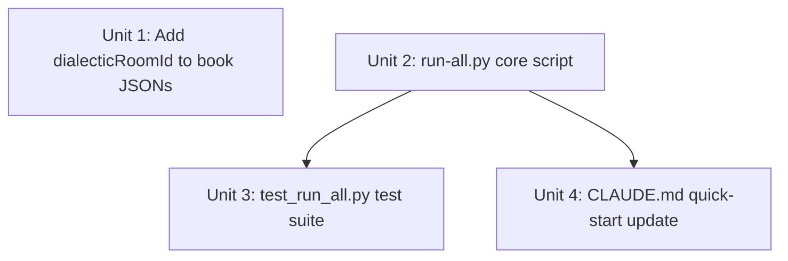

# feat: Add multi-book runner (run-all.py)

## Overview

Add `tools/bridge/run-all.py` — a stdlib-only orchestrator that runs the full thesis pipeline (fetch → export → diff → conditional push) for all active thesis-graph books in one command. Also adds `meta.dialecticRoomId` to both active book JSONs and documents the command in `CLAUDE.md`.

## Problem Frame

Running the pipeline for two theses currently requires two separate commands with different room IDs. Automation via cron requires two cron entries that must be kept in sync. The runner collapses this to one command and moves room-ID configuration into the book JSON where it belongs.

(see origin: `docs/brainstorms/2026-03-31-multi-book-runner-requirements.md`)

## Requirements Trace

- R1–R3. Book discovery: read `books/*.json`, filter `meta.type == "thesis-graph"`, sort alphabetically, process sequentially
- R4–R6. Configuration: room ID in `meta.dialecticRoomId`; shared `DIALECTIC_ROOM_TOKEN`; export-only for books without room ID
- R7–R9. Snapshot management: per-book `{id}-latest.json` / `{id}-prev.json`; first-run detection; copy-before-export
- R10–R11. Failure handling: continue-on-failure; exit non-zero if any book failed
- R12–R14. Usability: `--dry-run`, `--books DIR`, line-per-book summary to stdout after all books complete
- Success criteria: `python3 tools/bridge/run-all.py` works end-to-end; cron-compatible; adding a new thesis requires no script changes

## Scope Boundaries

- No snapshot ring buffer — only current + previous per book
- No HTML generation — export-only
- No parallel processing
- No retry / backoff
- No per-book token support
- No `--dialectic-url` on the runner (see origin)

## Context & Research

### Relevant Code and Patterns

- `tools/bridge/push_to_dialectic.py` — canonical script structure: docstring with exit codes, `build_parser()` separated from `main()`, `get_room_token()`, `load_snapshot()`, stdout=JSON/stderr=human-readable, `sys.exit()` for all exits
- `tools/bridge/diff_snapshots.py` — exit codes 0=changes, 1=no-changes, 2=error; positional args `old new`; all errors to stderr, delta JSON to stdout
- `tools/validation/e2e_test.py` — canonical subprocess path resolution: `ROOT = Path(__file__).resolve().parent.parent.parent`; all three script path constants defined at module level; shows how to invoke thesisgraph with `--fetch --export-state`
- `tools/bridge/test_push.py` — `importlib.import_module("push-to-dialectic")` pattern for hyphenated modules; `build_parser()` testability separation; `HTTPServer` in background thread for push integration tests
- `tools/bridge/test_diff.py` — `subprocess.run([sys.executable, SCRIPT, ...], capture_output=True)` helper pattern; `tmp_path` fixture for file isolation; test classes by concern (`TestErrorPaths`, `TestEdgeCases`, etc.)

### Institutional Learnings

- `docs/solutions/` is nascent; no prior art for pipeline orchestration. Follow the patterns in `e2e_test.py` and `test_diff.py` directly.

## Key Technical Decisions

- **`build_parser()` separated from `main()`**: Mirrors `push_to_dialectic.py` convention. Enables direct unit testing of argparse without triggering `sys.exit`.
- **Subprocess stream handling per step**: thesisgraph stderr flows through (progress visible in cron logs); diff stdout is captured (prevents JSON delta from leaking into run-all's stdout, which is reserved for the summary); push stdout is captured (suppresses verbose response JSON noise); all stderr flows through for immediate visibility in cron/terminal.
- **Failure state via boolean accumulator**: A single `any_failed` bool accumulates per-book failures. `sys.exit(1 if any_failed else 0)` at the end satisfies R11 without complex state management.
- **Per-book result dict**: Track `{export, changed, pushed, status}` per book for the summary line. Populated as each step completes; "–" for steps that were skipped.
- **Book ID from filename stem**: `Path(book_file).stem` — no new schema field. (see origin: Key Decisions)
- **Alphabetical sort enforced**: `sorted(Path(books_dir).glob("*.json"))` — explicit sort, not filesystem order. (see origin: R3)

## Open Questions

### Resolved During Planning

- **Which subprocess output streams to capture vs. pass through for each step?** Resolved: thesisgraph — both pass through (export writes to file, not stdout); diff — capture stdout only (stop JSON delta reaching run-all's stdout); push — capture stdout (suppress success JSON), stderr passthrough. Exit codes always available from `result.returncode` regardless of capture mode.
- **Where does `run-all.py` resolve script paths?** Resolved: `ROOT = Path(__file__).resolve().parent.parent.parent` matches the pattern in `e2e_test.py` (run-all.py is 3 levels below repo root in `tools/bridge/`).
- **What snapshots dir to use?** Resolved: `ROOT / "snapshots"` — relative to repo root, not to `tools/bridge/`. Directory already exists in the repo.

### Deferred to Implementation

- **What room IDs to put in the book JSONs?** These are real Dialectic room UUIDs obtained at room-setup time. Unit 1 adds placeholder comments in the JSONs; the actual UUIDs are filled in manually.
- **Does thesisgraph.py's `--fetch` produce any stdout?** Confirmed stdout is empty when `--export-state FILE` is used (writes to file), so no stream management needed for thesisgraph stdout.

## High-Level Technical Design

> *This illustrates the intended approach and is directional guidance for review, not implementation specification. The implementing agent should treat it as context, not code to reproduce.*

**Stream handling matrix per subprocess call:**

| Step | stdout | stderr | How exit code determines flow |
|------|--------|--------|-------------------------------|
| `thesisgraph --fetch --export-state` | pass through (empty) | pass through | non-zero → mark book failed, skip diff+push |
| `diff-snapshots prev latest` | captured (suppress JSON) | pass through | 0 → push; 1 → skip push; 2 → mark failed |
| `push-to-dialectic --snapshot --room-id` | captured (suppress response JSON) | pass through | non-zero → mark book failed |

**Per-book control flow:**

```
book = load_and_validate_book(path)     # exits early if not thesis-graph type
copy latest → prev (if latest exists)
run thesisgraph → if fail: record, continue to next book
# First-run detection: after thesisgraph succeeds, check if prev_path exists.
# If it does not exist, latest did not exist before this run → first run.
if not prev_path.exists(): log info "[info] first run", record result, continue
if not room_id (falsy): log warn "[warn] no dialecticRoomId", record result, continue
run diff → if exit 2: record fail, continue
           if exit 1: record changed=no, skip push, continue
           if exit 0: run push → record result
record summary line
```

## Implementation Units



---

- [ ] **Unit 1: Add `dialecticRoomId` to active book JSONs**

**Goal:** Satisfy R4. Both active book JSONs carry a `meta.dialecticRoomId` field so the runner can push to Dialectic without runtime errors.

**Requirements:** R4, R5

**Dependencies:** None

**Files:**
- Modify: `books/iran-hormuz-graph.json`
- Modify: `books/trump-tariffs-graph.json`

**Approach:**
- Add `"dialecticRoomId": ""` to the `meta` block of both files (alongside `title`, `asOf`, `version`, `type`, `monthlyBudget`)
- Leave value as empty string or `null` until the actual Dialectic room UUID is available from the Dialectic admin
- Add a `// NOTE` comment in the surrounding context (via JSON field naming convention) is not possible in JSON — the empty value itself signals "needs setup"
- The runner's R6 (export-only for missing room ID) gracefully handles empty strings — treat `""` and `null` as absent for routing purposes

**Test scenarios:**
Test expectation: none — this is a data-only change, verified by observation (runner logs "[warn] ...: no dialecticRoomId" or reads the field successfully).

**Verification:**
- `python3 -c "import json; d=json.load(open('books/iran-hormuz-graph.json')); assert 'dialecticRoomId' in d['meta']"` passes for both books

---

- [ ] **Unit 2: `tools/bridge/run-all.py` core script**

**Goal:** Implement the full multi-book runner satisfying R1–R14.

**Requirements:** R1–R14 (all)

**Dependencies:** Unit 1 for end-to-end push; functionally independent (empty/null room IDs just trigger the export-only path)

**Files:**
- Create: `tools/bridge/run-all.py`

**Approach:**
- Script structure mirrors `push_to_dialectic.py`: module docstring with usage + exit codes, `build_parser()` separated from `main()`, constants at top for script paths, `if __name__ == "__main__": main()`
- Path resolution: `ROOT = Path(__file__).resolve().parent.parent.parent` (same as `e2e_test.py`)
- **Startup validation**: check `snapshots_dir = ROOT / "snapshots"` exists before processing any books; if absent, print error to stderr and `sys.exit(2)` with a clear message
- Book discovery: `sorted(Path(books_dir).glob("*.json"))` → for each file, `json.load()` wrapped in `try/except (json.JSONDecodeError, OSError)` → log `[error] {book_id}: invalid JSON — skipped`, mark as failed, continue → check `data.get("meta", {}).get("type") == "thesis-graph"` → silently skip non-matching
- Snapshot paths: `snapshots_dir = ROOT / "snapshots"`, then `latest = snapshots_dir / f"{book_id}-latest.json"`, `prev = snapshots_dir / f"{book_id}-prev.json"`
- Pre-export snapshot copy: `shutil.copy2(latest, prev)` if `latest.exists()`
- **First-run detection**: after thesisgraph succeeds, check `prev.exists()`. If `prev` does not exist, latest was absent before this run (the copy step only copies if latest existed). Log `[info] {book_id}: first run — snapshot saved, no diff` and continue to next book
- Per-book result: a dict `{"export": "-", "changed": "-", "pushed": "-", "status": "FAIL"/"OK"}` initialized before the pipeline; updated as each step runs
- **thesisgraph step**: `subprocess.run([sys.executable, THESISGRAPH, str(book_path), "--fetch", "--export-state", str(latest)], check=False)` — no stream args (both flow through)
- **diff step**: `subprocess.run([sys.executable, DIFF_SNAPSHOTS, str(prev), str(latest)], stdout=subprocess.PIPE, check=False)` — stdout captured (suppress JSON); stderr flows through
- **push step**: `subprocess.run([sys.executable, PUSH_SCRIPT, "--snapshot", str(latest), "--room-id", room_id], stdout=subprocess.PIPE, check=False)` — stdout captured (suppress response JSON); stderr flows through
- `any_failed` bool accumulated across books; `sys.exit(1 if any_failed else 0)` at end
- Summary block: after all books, print aligned per-book lines to stdout; column-align the book IDs for readability
- **`--dry-run` behavior**: discover books, then for each book print: `[dry-run] {book_id}: room={room_id or "NONE"} snapshot={latest_path} prev={prev_path}`; do not invoke any subprocess; exit 0

**Patterns to follow:**
- `tools/bridge/push_to_dialectic.py` — script structure, docstring format, `build_parser()` convention, stderr/stdout split
- `tools/validation/e2e_test.py` — `ROOT`, `THESISGRAPH`, `DIFF_SNAPSHOTS`, `PUSH_SCRIPT` constant definitions

**Test scenarios:** (covered in Unit 3)

**Verification:**
- `python3 tools/bridge/run-all.py --dry-run` prints book discovery output and exits 0
- `python3 tools/bridge/run-all.py --help` shows all flags without error
- `python3 -m pytest tools/bridge/test_run_all.py -q` passes (Unit 3)

---

- [ ] **Unit 3: `tools/bridge/test_run_all.py` test suite**

**Goal:** Provide pytest coverage for all pipeline branches and flag behaviors.

**Requirements:** R1–R14 (test-facing surface)

**Dependencies:** Unit 2 (run-all.py must exist)

**Files:**
- Create: `tools/bridge/test_run_all.py`

**Approach:**
- Module-level SCRIPT constant: `SCRIPT = str(Path(__file__).parent / "run-all.py")`
- Helper `run_all(args, env=None, books_dir=None) -> (stdout, returncode)`: invokes `subprocess.run([sys.executable, SCRIPT, ...], capture_output=True, text=True, env=...)`
- All tests use `tmp_path` for isolated `books/` and `snapshots/` directories; pass `--books {tmp_books_dir}` to the runner
- Minimal valid book JSON fixture: `{"meta": {"type": "thesis-graph", "title": "Test", "dialecticRoomId": "test-room-id"}, "nodes": [], "edges": []}`
- Legacy book fixture: same structure but without `meta.type` field (or with a different type)
- Fake thesisgraph: small Python script written to `tmp_path` that creates a minimal snapshot JSON and exits 0; passed via `THESISGRAPH` env var override OR path substitution. Alternatively: monkeypatch `THESISGRAPH` constant on the module (if importable) or use subprocess path injection.

Note: since the scripts are invoked via subprocess, the test approach should either:
  a) Write tiny stub scripts to `tmp_path` and pass their paths via environment or flag overrides, OR
  b) Import run_all module and monkeypatch its script constants before calling `main()`
  
  Option (b) is cleaner: use `importlib.import_module` (handle the hyphen if the file is `run-all.py`), monkeypatch `THESISGRAPH`, `DIFF_SNAPSHOTS`, `PUSH_SCRIPT` constants with paths to stub scripts written in `tmp_path`. Follow `test_push.py`'s importlib pattern.

**Test scenarios:**

- **Happy path: two thesis books discovered, one legacy skipped**
  - `books/` has `a-thesis.json` (thesis-graph), `b-thesis.json` (thesis-graph), `legacy.json` (no `meta.type`)
  - Stubs: thesisgraph exits 0 and writes snapshot; diff exits 1 (no changes)
  - Expect: summary shows 2 books processed; legacy not mentioned; exit 0

- **Happy path: alphabetical order enforced**
  - `books/` has `z-thesis.json` and `a-thesis.json`
  - Capture stdout and assert `a-thesis` appears before `z-thesis` in output

- **Happy path: changes found → push succeeds**
  - Stubs: thesisgraph exits 0; diff exits 0; push exits 0
  - Expect: summary line shows `export=OK changed=yes pushed=OK`; exit 0

- **Happy path: no changes → push skipped**
  - Stubs: thesisgraph exits 0; diff exits 1 (no changes); push never called
  - Expect: summary line shows `export=OK changed=no pushed=-`; exit 0

- **Happy path: first run (no prev snapshot)**
  - No `{id}-latest.json` exists before run
  - Stubs: thesisgraph exits 0 (writes snapshot)
  - Expect: diff not called; push not called; `[info]` log visible in stderr; exit 0

- **Edge case: book with no `dialecticRoomId`**
  - Book JSON has no `dialecticRoomId` field
  - Stubs: thesisgraph exits 0
  - Expect: `[warn]` message in stderr; diff and push not called; exit 0

- **Edge case: `dialecticRoomId` is empty string**
  - Same as above — empty string treated as absent

- **Edge case: empty books directory**
  - `books/` has no `*.json` files
  - Expect: no errors, exit 0, summary shows zero lines

- **Error path: thesisgraph fails**
  - Stub: thesisgraph exits 1
  - Expect: book marked failed; second book (if present) still runs; runner exits 1

- **Error path: diff exits 2 (error)**
  - Stubs: thesisgraph exits 0; diff exits 2
  - Expect: push not called; book marked failed; runner exits 1

- **Error path: push fails**
  - Stubs: thesisgraph exits 0; diff exits 0; push exits 1
  - Expect: book marked failed; runner exits 1

- **Error path: one book fails, others succeed → exit 1**
  - Two books; first book's thesisgraph fails; second book's pipeline succeeds
  - Expect: runner exits 1; second book summary shows OK

- **`--dry-run` flag**
  - Stubs: none called
  - Expect: output mentions both book IDs and their planned snapshot paths; no subprocess calls; exit 0

- **`--books DIR` override**
  - Pass a custom `--books` directory containing one thesis book
  - Expect: only that book is processed

- **Snapshot rotation: prev correctly replaced**
  - Write a pre-existing `{id}-latest.json` with content A
  - Run the runner (diff exits 1 for simplicity)
  - Expect: `{id}-prev.json` now contains content A; `{id}-latest.json` is the new snapshot

**Verification:**
- `python3 -m pytest tools/bridge/test_run_all.py -q` passes all tests
- Coverage includes all pipeline branches: first-run, no-roomId, changes, no-changes, failure paths, dry-run

---

- [ ] **Unit 4: `CLAUDE.md` quick-start update**

**Goal:** Document `run-all.py` in the project quick-start so the command is discoverable.

**Requirements:** Success criteria (cron entry documented)

**Dependencies:** Unit 2

**Files:**
- Modify: `CLAUDE.md`

**Approach:**
- Add a new `# === Pipeline Runner ===` section in the Quick Start (after the existing Thesis Graph Engine block; `run-all.py` lives in `tools/bridge/`, not the thesis engine)
- Include the basic invocation: `python3 tools/bridge/run-all.py`
- Include the `--dry-run` flag example
- Include the cron template with a note that `DIALECTIC_ROOM_TOKEN` and `--dialectic-url` must be configured for production pushes: `DIALECTIC_ROOM_TOKEN=<token> python3 tools/bridge/run-all.py` (or set the env var in `~/.profile`). Note that `push_to_dialectic.py` defaults to `localhost:8002` — production use requires the Dialectic URL to be set via `DIALECTIC_URL` env var (if implemented) or by running the push script separately with `--dialectic-url`
- Full cron template: `0 8 * * 1,3,5 cd /path/to/tradingDesk && python3 tools/bridge/run-all.py >> logs/run-all.log 2>&1`

**Test scenarios:**
Test expectation: none — documentation change; verified by inspection.

**Verification:**
- `CLAUDE.md` quick-start section includes `run-all.py` with at least the basic invocation and cron template

---

## System-Wide Impact

- **Interaction graph:** `run-all.py` is a new entry point that wraps three existing scripts. It does not modify `thesisgraph.py`, `diff_snapshots.py`, or `push_to_dialectic.py` — no callbacks or middleware are affected. The `books/*.json` schema gets a new `meta.dialecticRoomId` field (additive, backward-compatible with existing scripts that ignore unknown fields).
- **Error propagation:** Subprocess failures surface as non-zero `returncode` → set `any_failed = True` → `sys.exit(1)` at end. The failed book's stderr messages (from child scripts) flow through directly.
- **State lifecycle risks:** The `shutil.copy2(latest, prev)` step runs before the thesisgraph export. If the process is killed between the copy and the export, the prev file will contain the last-known-good state, and the next run will re-copy it correctly. No data loss risk.
- **API surface parity:** The runner does not expose a new API — it is a CLI-only entry point. No changes to the snapshot JSON schema (R7-R9 use filenames, not schema fields).
- **Integration coverage:** The test suite (Unit 3) uses stub scripts rather than a mock server, so push integration is covered at the subprocess-exit-code level. Full end-to-end push coverage (against a real mock Dialectic server) is already covered in `tools/validation/e2e_test.py` for the underlying `push_to_dialectic.py` script. Run-all's push path is thin (it calls push with correct args and checks exit code); stubbing is sufficient.
- **Unchanged invariants:** `thesisgraph.py`, `diff_snapshots.py`, and `push_to_dialectic.py` are not modified. Their CLI contracts and exit codes are unchanged.

## Risks & Dependencies

| Risk | Mitigation |
|------|------------|
| `books/*.json` files that fail to parse as JSON (malformed) | Wrap `json.load()` in try/except; log `[error] {book_id}: invalid JSON — skipped`; mark as failed |
| `meta.dialecticRoomId` set to empty string instead of absent | Treat falsy values (`""`, `null`, `None`) as absent in the room-ID check |
| `snapshots/` directory does not exist | Check existence at startup and exit 2 with a clear message (it is present in the repo but could be missing in a fresh clone before the directory is committed) |
| Cron environment lacks `DIALECTIC_ROOM_TOKEN` | push_to_dialectic.py exits 2 with a clear message; run-all marks the book failed and exits 1, which cron logs. The cron template in CLAUDE.md should note the env var requirement. |
| `thesisgraph.py --fetch` makes network calls (Yahoo Finance, Polymarket) that may time out | No retry in the runner (see scope). Timeouts in thesisgraph appear as non-zero exit → book marked failed. This is the accepted behavior per the requirements doc. |
| `push_to_dialectic.py` defaults to `localhost:8002` (mock server port) — production pushes silently fail if no URL is configured | Note in CLAUDE.md cron template that production use requires Dialectic URL to be supplied. The runner's scope boundary excludes `--dialectic-url`; the URL must be configured in the environment or the push script invoked separately. |

## Documentation / Operational Notes

- Cron setup: `DIALECTIC_ROOM_TOKEN` must be available in the cron environment. Recommend setting it in `~/.profile` or the crontab file itself (e.g., `DIALECTIC_ROOM_TOKEN=...` before the cron line).
- First run per book: the runner emits `[info]` on first run (no prev snapshot to diff against). After the first successful run, subsequent runs will have prev/latest and will diff normally. This is expected behavior, not an error.
- `logs/` directory referenced in the cron template is not in the repo — it will need to be created manually or added to `.gitignore` as an empty directory.

## Sources & References

- **Origin document:** [`docs/brainstorms/2026-03-31-multi-book-runner-requirements.md`](docs/brainstorms/2026-03-31-multi-book-runner-requirements.md)
- **Subprocess pattern:** `tools/validation/e2e_test.py` (ROOT resolution, script constants)
- **Script structure pattern:** `tools/bridge/push_to_dialectic.py` (build_parser, docstring, exit code docs)
- **Test pattern:** `tools/bridge/test_push.py` (importlib pattern), `tools/bridge/test_diff.py` (subprocess + tmp_path)
- **Exit code contracts:** `tools/bridge/diff_snapshots.py` (lines 13-16), `tools/bridge/push_to_dialectic.py` (lines 24-27)
